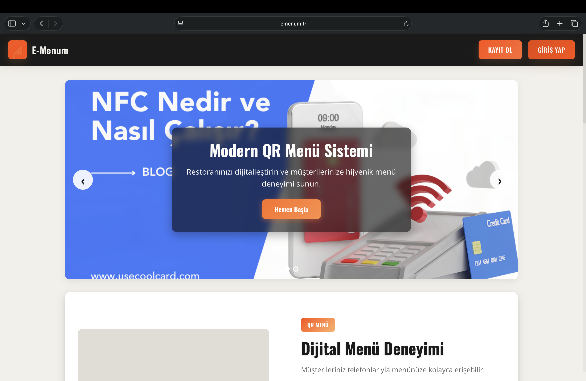

<div align="center">


&nbsp;

&nbsp;


<br /><br />

# E-Menum — QR & NFC Restoran Yönetim Platformu
### *QR & NFC Restaurant Management Platform*

**Restoranlar için tam kapsamlı dijital dönüşüm çözümü — QR menü, NFC sipariş, masa yönetimi, Kasa POS ve mini ERP tek platformda.**

*A full-stack SaaS platform for restaurants — QR menus, NFC ordering, table management, POS system, and a built-in mini ERP — all in one place.*

<br />

[](https://emenum.tr)
[](https://github.com/Denizsvnc)
[](./LICENSE)

</div>

---

## 🇹🇷 Türkçe

### 💡 Bu Proje Neden Ortaya Çıktı?

Restoranlarda QR kod menü sistemleri yaygınlaşırken kritik bir güvenlik açığı gözden kaçıyordu:

> **QR kodunun fotoğrafını çeken herhangi biri evden sahte sipariş verebilir.** Bir müşteri masadaki QR'ı telefona kaydeder, restorandan çıktıktan sonra da — hatta tamamen yabancı biri de — sisteme sipariş gönderebilir. QR, özünde sadece bir linkten ibarettir ve kopyalanması çocuk oyuncağıdır.

Bu açığın farkına varıldığında çözüm de netleşti:

> **NFC kartı kopyalamak, QR kopyalamakla kıyaslanamayacak kadar zordur.** NFC'de fiziksel temasa gerek vardır; kart masada olmalıdır. Uzaktan erişim, ekran görüntüsü veya fotoğrafla sipariş vermek mümkün değildir. Bu, hem sahte sipariş riskini ortadan kaldırır hem de restoran operasyonunu güvence altına alır.

**🔐 Token Tabanlı Oturum Güvenliği:**

Platformda her sipariş oturumu (hem QR hem NFC) başlatıldığında sisteme **zaman sınırlı bir token** iletilir. Bu tokenın geçerlilik süresi işletme sahibi tarafından serbestçe belirlenir.

- **QR ile:** Kod tekrar tekrar taranabilir ve her taramada yeni token alınabilir. Kopyalanan QR, sahip olduğu sürece bu tokenları almaya devam edebilir.
- **NFC ile:** Token almak için NFC kartının fiziksel olarak okutulması şarttır. Kart masada yoksa, uzaktaysa veya başkasının elindeyse — token alınamaz, dolayısıyla sipariş başlatılamaz.

> Bu mimari, "token ele geçirme" saldırılarını donanım katmanında engeller: **kart yoksa token yok, token yoksa sipariş yok.**

| Münü Sipariş Ekranı | Token Süresi Doldu Ekranı |
|:---:|:---:|
|  |  |

> 🔍 *URL barına dikkat: her oturumda benzersiz bir `token` parametresi görülebilir. Süresi dolan token, sayfayı otomatik olarak kilitler.*

### 📖 Proje Hakkında

**E-Menum**, restoranlar ve kafeler için geliştirilmiş uçtan uca bir **SaaS + mini ERP** platformudur. Sistem yalnızca bir dijital menü değildir; sipariş yönetimi, masa takibi, gelir/sipariş analitiği, işletme hareketleri logu ve abonelik yönetimini kapsayan **entegre bir işletme yönetim çözümüdür.**

İşletmeler QR menü oluşturabilir, NFC kartlarla temassız sipariş alabilir, masa düzenlerini yönetebilir, Kasa POS üzerinden siparişleri anlık işleyebilir ve gösterge panelinden işletme performansını takip edebilir.

Platform tek geliştirici tarafından sıfırdan tasarlanıp kodlanmıştır; ön yüzden arka yüze, ödeme entegrasyonundan POS sistemine kadar her modül bütünüyle özgündür.

### ✨ Özellikler

#### 🍽️ Dijital Menü & QR Sistemi
- QR kod oluşturma ve yönetimi
- Özelleştirilebilir menü şablonları (Modern, Minimalist, Görsel Odaklı ve daha fazlası)
- Kategori ve ürün yönetimi (görsel, fiyat, açıklama)
- Birden fazla QR menü profili oluşturabilme

#### 📱 NFC Teknolojisi — Güvenli Sipariş Altyapısı
- NFC kart siparişi (Hazır paket veya Manuel paket)
- QR kodları NFC kartlara yazma ve dağıtma
- Müşteriler telefonu karta yaklaştırarak anında menüye erişim
- **Fiziksel kart zorunluluğu** → sahte/uzaktan sipariş riski elimine edilir
- Temassız ama güvenli sipariş deneyimi

#### 🏪 İşletme & Masa Yönetimi
- Çoklu işletme desteği (Multi-Tenant mimari)
- Masa ekleme, düzenleme ve anlık doluluk takibi (Dolu / Boş)
- İşletme bazlı sipariş görüntüleme ve yönetimi
- İşletme hareketleri ve log takibi

#### 💳 Kasa / POS Sistemi
- Ayrı kasa görevlisi giriş ekranı (PIN tabanlı)
- Anlık sipariş akışı görüntüleme
- Masa bazlı sipariş ve ödeme işlemleri
- Gelen siparişler ekranı ve sipariş yönetimi

#### 📊 Mini ERP — Gösterge Paneli & Analitik
- Son 7 gün sipariş trendi (çizgi grafik)
- Son 7 gün gelir trendi (çizgi grafik)
- Kategori ve sipariş durumu dağılımı (pasta grafik)
- Toplam sipariş, gelir, aktif kategori ve QR kod sayacı
- İşletme hareketleri ve tam log kaydı
- Satın alma geçmişi takibi

> 🏢 **Mini ERP Notu:** E-Menum yalnızca bir menü uygulaması değildir. Sipariş → Masa → Kasa → Analitik → Log döngüsünü tek çatı altında yöneten, küçük ve orta ölçekli restoran işletmecileri için tasarlanmış **hafif bir ERP sistemidir.**

#### 💰 Abonelik & Ödeme
- 3 kademeli paket yapısı: Başlangıç, Profesyonel, Kurumsal
- Aylık / Yıllık / 3 Yıllık abonelik seçenekleri
- **İyzico** ödeme altyapısı entegrasyonu
- Satın alma işlemleri geçmişi (LOG)

### 🖼️ Ekran Görüntüleri

| Anasayfa | Giriş Ekranı | Gösterge Paneli |
|:---:|:---:|:---:|
|  |  |  |

| Menü Şablonları | Masa Yönetimi | Üyelik Paketleri |
|:---:|:---:|:---:|
|  |  |  |

| NFC İşlemleri | Kasa POS Girişi | Kasa POS Siparişler |
|:---:|:---:|:---:|
|  |  |  |

| Menü Sayfası — Sipariş Verme | Token Süresi Doldu (Güvenlik Ekranı) |
|:---:|:---:|
|  |  |

> 💡 Daha fazla ekran görüntüsü için `screenshots/` klasörüne göz atın.

---

## 🌐 Demo Erişimi

> [!WARNING]
> **Bu repo yalnızca portföy/tanıtım amaçlıdır. Kaynak kod paylaşılmamaktadır.**
> Platform şu anda **demo/test aşamasındadır** ve ticari olarak aktif değildir. Bazı sayfalar ve özellikler, ticari faaliyetin önüne geçmemek amacıyla sunucu tarafında erişime kapatılmıştır.

**Demoyu ücretsiz deneyebilirsiniz:**
1. [emenum.tr](https://emenum.tr) adresine gidin ve **ücretsiz** hesap oluşturun
2. Üyelik satın almak için aşağıdaki **İyzico test kartını** kullanın (gerçek ödeme alınmaz):

| Alan | Değer |
|---|---|
| Kart Numarası | `5528790000000008` |
| Son Kullanma | `12/30` |
| CVV | `123` |
| 3D Şifre | `a` |

---

## 🇬🇧 English

### 💡 Why Was This Project Built?

As QR code menus became mainstream in restaurants, a critical security flaw was being widely overlooked:

> **Anyone who photographs a QR code can place fake orders from anywhere.** A customer could scan the table QR, walk out of the restaurant, and keep ordering — or share it with anyone. A QR code is ultimately just a URL, and copying it is trivially easy.

Once this gap was identified, the solution became clear:

> **Cloning an NFC card is exponentially harder than copying a QR code.** NFC requires physical proximity — the card must be present at the table. Remote ordering via a screenshot or photo is simply not possible. This eliminates fake order risk and secures restaurant operations at the hardware level.

**🔐 Token-Based Session Security:**

Every order session initiated (via either QR or NFC) transmits a **time-limited token** to the system. The token's validity duration is freely configured by the business owner.

- **With QR:** The code can be scanned repeatedly, and a new token can be obtained on each scan. A copied QR code can keep receiving tokens indefinitely.
- **With NFC:** A token can only be obtained by physically tapping the NFC card. If the card is not at the table, is far away, or is in someone else's possession — no token is issued, and no order can be initiated.

> This architecture prevents "token hijacking" at the hardware level: **no card = no token, no token = no order.**

| Menu Page — Placing an Order | Token Expired (Security Screen) |
|:---:|:---:|
|  |  |

> 🔍 *Notice the URL bar: each session carries a unique `token` parameter. When the token expires, the page automatically locks — no further orders can be placed.*

### 📖 About The Project

**E-Menum** is a full-stack **SaaS + mini ERP** platform built entirely from scratch by a single developer. It is not just a digital menu — it is an **integrated business management solution** covering order management, table tracking, revenue/order analytics, business activity logs, and subscription management.

Restaurants can create QR menus, receive contactless orders via NFC cards, manage table layouts, process orders through a cashier POS system, and monitor business performance from a unified dashboard.

Every module — from frontend to backend, payment integration to POS — was independently designed and implemented.

### ✨ Features

#### 🍽️ Digital Menu & QR System
- QR code generation and management
- Customizable menu templates (Modern, Minimalist, Visual-Focused, and more)
- Category and product management (image, price, description)
- Multiple QR menu profiles per business

#### 📱 NFC Technology — Secure Order Infrastructure
- NFC card ordering (Pre-packaged or Manual)
- Write QR codes to NFC cards for table/door distribution
- Customers tap their phone to instantly access the menu
- **Physical card required** → eliminates fake/remote order risk entirely
- Contactless but hardware-secured ordering experience

#### 🏪 Business & Table Management
- Multi-tenant architecture (multiple businesses per account)
- Add, edit, and track table availability in real-time (Occupied / Available)
- Per-business order viewing and management
- Business activity and log tracking

#### 💳 POS / Cash Register System
- Dedicated cashier login screen (PIN-based)
- Live order stream view
- Table-based order and payment processing
- Incoming orders screen with order management

#### 📊 Mini ERP — Dashboard & Analytics
- Last 7-day order trend (line chart)
- Last 7-day revenue trend (line chart)
- Category and order status distribution (pie chart)
- Total order, revenue, active category, and QR code counters
- Full business activity and audit log
- Purchase and billing history tracking

> 🏢 **Mini ERP Note:** E-Menum is not just a menu app. It manages the full Order → Table → POS → Analytics → Log cycle under one roof — a **lightweight ERP system** designed for small and medium-sized restaurant operators.

#### 💰 Subscriptions & Payments
- 3-tier plan structure: Starter, Professional, Corporate
- Monthly / Yearly / 3-Year billing options
- **Iyzico** payment gateway integration
- Purchase history log

### 🖼️ Screenshots

| Landing Page | Login Screen | Dashboard |
|:---:|:---:|:---:|
|  |  |  |

| Menu Templates | Table Management | Membership Plans |
|:---:|:---:|:---:|
|  |  |  |

| NFC Operations | POS Cashier Login | POS Incoming Orders |
|:---:|:---:|:---:|
|  |  |  |

| Menu Page — Placing an Order | Token Expired (Security Screen) |
|:---:|:---:|
|  |  |

> 💡 Browse the `screenshots/` folder for more visuals.

---

## 🌐 Demo Access

> [!WARNING]
> **This repository is for portfolio/showcase purposes only. Source code is not included.**
> The platform is currently in **demo/test phase** and is not commercially active. Certain pages and features are intentionally restricted at the server level to prevent commercial misuse during development.

**You can try the demo for free:**
1. Visit [emenum.tr](https://emenum.tr) and create a **free** account
2. Use the **Iyzico test card** below to purchase a subscription (no real charge):

| Field | Value |
|---|---|
| Card Number | `5528790000000008` |
| Expiry | `12/30` |
| CVV | `123` |
| 3D Password | `a` |

---

## 📂 Repository Structure

```
emenum.tr/               ← Showcase repository (no source code)
├── screenshots/
│   ├── landing/         ← Public landing page
│   ├── auth/            ← Login & registration screens
│   ├── dashboard/       ← Analytics dashboard
│   ├── features/        ← Menu, NFC, table, category screens
│   └── pos/             ← POS cashier system screens
└── README.md
```

---

## ⚖️ Fikri Mülkiyet & Lisans / Intellectual Property & License

> [!CAUTION]
> **🇹🇷** Bu platformda yer alan NFC kart teknolojisinin QR restoran menüsüyle entegre edilmesi fikri ve genel platform konsepti **tamamen özgün olup Deniz Sevinç'e aittir.** Konseptin, tasarımın veya iş akışının izinsiz kopyalanması ya da taklit edilmesi fikri mülkiyet ihlali teşkil eder.
>
> **🇬🇧** The concept of integrating NFC card technology with QR-based restaurant menus, along with the overall platform design and workflow, is **an entirely original idea conceived and owned by Deniz Sevinç.** Unauthorized copying, replication, or imitation of this concept may constitute intellectual property infringement.

This repository is protected under a **Proprietary All Rights Reserved** license.
Viewing is permitted. Copying, modifying, distributing, or commercial use is **strictly prohibited**.

📄 See the full [LICENSE](./LICENSE) file for details.

---

## 👤 Author / Geliştirici

<div align="center">

**Deniz Sevinç**

[](https://github.com/Denizsvnc)
&nbsp;
[](https://emenum.tr)

*Tüm tasarım ve geliştirme süreçleri tek geliştirici tarafından yürütülmüştür.*
*All design and development was carried out by a single developer.*

</div>

---

<div align="center">

© 2024–2025 Deniz Sevinç · E-Menum · All Rights Reserved · [emenum.tr](https://emenum.tr)

*Original concept & full implementation by a single developer.*
*Orijinal konsept ve tüm geliştirme tek bir geliştirici tarafından yapılmıştır.*

</div>
